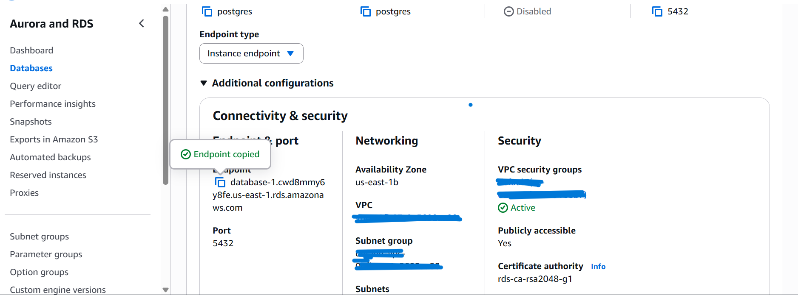
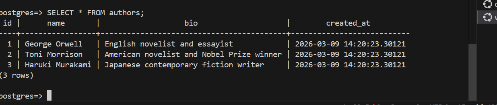
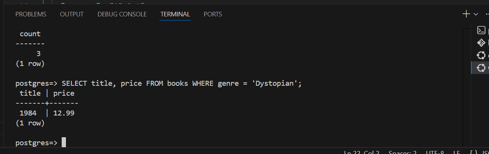
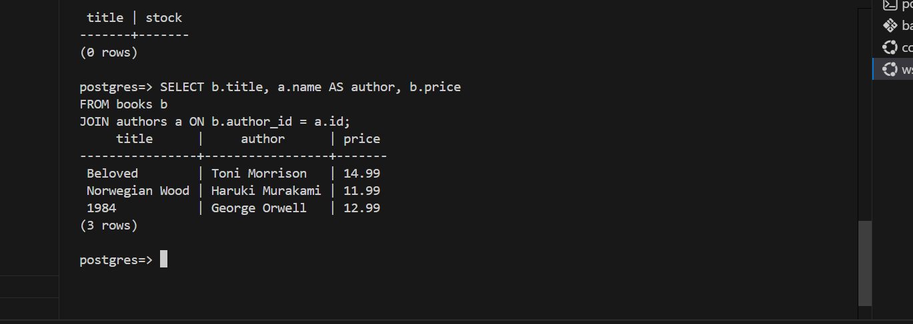

# 📚 Bookstore REST API

A RESTful API for managing a bookstore, built with **Node.js**, **Express**, and **PostgreSQL** hosted on **AWS RDS**. This project demonstrates backend API development with cloud-based database infrastructure.

## Architecture

Client (curl / Postman / Browser)
│
▼
Express Server (Node.js)
│
▼
PostgreSQL (AWS RDS)

## Tech Stack

- **Runtime:** Node.js
- **Framework:** Express.js
- **Database:** PostgreSQL 15
- **Cloud:** AWS RDS
- **ORM:** Raw SQL via node-postgres (pg)
- **Environment Management:** dotenv

## Features

- Full CRUD operations for authors and books
- Order placement with stock validation
- Transaction-based order processing with rollback on failure
- Genre-based book filtering
- Relational data with JOIN queries
- Structured error handling

## Database Schema


authors
├── id (PK)
├── name
├── bio
└── created_at  -

books
├── id (PK)
├── title
├── author_id (FK → authors)
├── genre
├── price
├── stock
├── published_date
└── created_at  - 

customers
├── id (PK)
├── name
├── email (UNIQUE)
└── created_at  -

orders
├── id (PK)
├── customer_id (FK → customers)
├── order_date
└── total  - 

order_items
├── id (PK)
├── order_id (FK → orders)
├── book_id (FK → books)
├── quantity
└── price  - 

## Getting Started

### Prerequisites

- Node.js (v18+)
- PostgreSQL database (local or AWS RDS)
- npm

### Installation

1. Clone the repository

```bash
git clone https://github.com/your-username/bookstore-api.git
cd bookstore-api
```

2. Install dependencies

```bash
npm install
```
3. Set up the database cluster and instance on Amazon RDS

Go to your AWS Management Console and navigate to Aurora and RDS
Click on Databases and click Create Database
Create a postgres databse. You could also choose the Aurora (Postgres compatible)
Ensure your rds instance is publicy accessible (this is not best practices, use this option for this purpose only)
Wait for some minutes for the database instance to launch. Then you will connect to the instance via the endpoint. 
To be able to connect to the instance, you will need to have psql installed either on your local machine or on a virtual machine or an ec2 instance. Copy the endpoint as shown below and use the following command to connect

```
psql -h bookstore-db.c9xxxxx.us-east-1.rds.amazonaws.com -U admin -d bookstore # Ensure you edit the url
```
After logging into psql, create tables inside psql
```
CREATE TABLE authors (
    id SERIAL PRIMARY KEY,
    name VARCHAR(255) NOT NULL,
    bio TEXT,
    created_at TIMESTAMP DEFAULT NOW()
);

CREATE TABLE books (
    id SERIAL PRIMARY KEY,
    title VARCHAR(255) NOT NULL,
    author_id INT REFERENCES authors(id) ON DELETE SET NULL,
    genre VARCHAR(100),
    price NUMERIC(10, 2) NOT NULL,
    stock INT DEFAULT 0,
    published_date DATE,
    created_at TIMESTAMP DEFAULT NOW()
);

CREATE TABLE customers (
    id SERIAL PRIMARY KEY,
    name VARCHAR(255) NOT NULL,
    email VARCHAR(255) UNIQUE NOT NULL,
    created_at TIMESTAMP DEFAULT NOW()
);

CREATE TABLE orders (
    id SERIAL PRIMARY KEY,
    customer_id INT REFERENCES customers(id) ON DELETE CASCADE,
    order_date TIMESTAMP DEFAULT NOW(),
    total NUMERIC(10, 2) DEFAULT 0
);

CREATE TABLE order_items (
    id SERIAL PRIMARY KEY,
    order_id INT REFERENCES orders(id) ON DELETE CASCADE,
    book_id INT REFERENCES books(id) ON DELETE SET NULL,
    quantity INT NOT NULL CHECK (quantity > 0),
    price NUMERIC(10, 2) NOT NULL
);
```
Add Test data into the tables 
```
INSERT INTO authors (name, bio) VALUES
('George Orwell', 'English novelist and essayist'),
('Toni Morrison', 'American novelist and Nobel Prize winner'),
('Haruki Murakami', 'Japanese contemporary fiction writer');

INSERT INTO books (title, author_id, genre, price, stock, published_date) VALUES
('1984', 1, 'Dystopian', 12.99, 50, '1949-06-08'),
('Beloved', 2, 'Historical Fiction', 14.99, 30, '1987-09-02'),
('Norwegian Wood', 3, 'Literary Fiction', 11.99, 40, '1987-09-04');

INSERT INTO customers (name, email) VALUES
('Alice Johnson', 'alice@example.com'),
('Bob Smith', 'bob@example.com');
```

Still inside psql, you could decide to query some of the data we just inputed
You could view the data in the various tables using the following tables
```
SELECT * FROM authors;
SELECT * FROM books;
SELECT * FROM customers;
SELECT * FROM orders;
SELECT * FROM order_items;
```
The image below shows an example of what you will see when you run one of the commands


You could run other commands to query and view your data to get yourself familiar with postgres
Here are some filtered queries
```
SELECT title, price FROM books WHERE genre = 'Dystopian'; # select books by genre
SELECT title, stock FROM books WHERE stock < 10; # select book with low stocks
SELECT b.title, a.name AS author, b.price 
FROM books b 
JOIN authors a ON b.author_id = a.id; # select books with author names
```




4. Create a `.env` file in the root directory
Add the following parameters to your .env file
```
DB_HOST=your-rds-endpoint.amazonaws.com
DB_PORT=5432
DB_USER=your-db-username
DB_PASSWORD=your-db-password
DB_NAME=bookstore
PORT=3000
```
5. Start the server

```bash
# Development (auto-restart on changes)
npm run dev

# Production
npm start
```

6. Get various API endpoints using curl
### Get all authors

```bash
curl http://localhost:3000/authors
```
### Add a new book

```bash
curl -X POST http://localhost:3000/books \
  -H "Content-Type: application/json" \
  -d '{
    "title": "Kafka on the Shore",
    "author_id": 3,
    "genre": "Literary Fiction",
    "price": 13.99,
    "stock": 25,
    "published_date": "2002-09-12"
  }'
```

Response:

```json
{
  "id": 4,
  "title": "Kafka on the Shore",
  "author_id": 3,
  "genre": "Literary Fiction",
  "price": 13.99,
  "stock": 25,
  "published_date": "2002-09-12",
  "created_at": "2026-03-09T12:00:00.000Z"
}
```

### Place an order

```bash
curl -X POST http://localhost:3000/orders \
  -H "Content-Type: application/json" \
  -d '{
    "customer_id": 1,
    "items": [
      { "book_id": 1, "quantity": 2 },
      { "book_id": 3, "quantity": 1 }
    ]
  }'
```

Response:

```json
{
  "order_id": 1,
  "total": 37.97
}
```

### Get order details

```bash
curl http://localhost:3000/orders/1
```

Response:

```json
{
  "id": 1,
  "customer_id": 1,
  "customer_name": "Alice Johnson",
  "email": "alice@example.com",
  "order_date": "2026-03-09T12:00:00.000Z",
  "total": 37.97,
  "items": [
    { "book_id": 1, "title": "1984", "quantity": 2, "price": 12.99 },
    { "book_id": 3, "title": "Norwegian Wood", "quantity": 1, "price": 11.99 }
  ]
}
```
## AWS Infrastructure

This project uses the following AWS services:

- **RDS (PostgreSQL 15)** — Managed relational database on `db.t3.micro`
- **VPC** — Isolated network with private subnets across two availability zones
- **Security Groups** — Firewall rules restricting access to port 5432

## License

MIT

I hope this documentation gives you a good understanding to relational database on the cloud using postgres
Reach out to me for contributions and questions. 